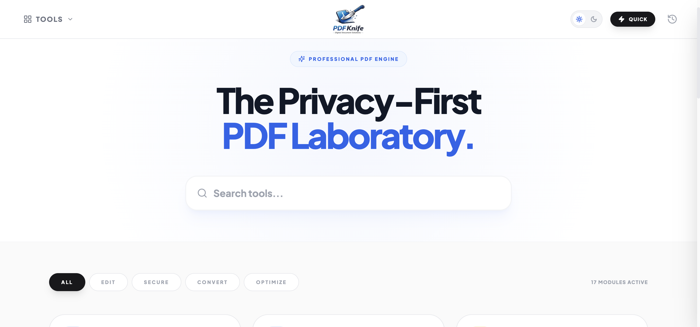

# PDF Knife

The privacy-first PDF toolkit. 100% client-side logic. No uploads, no servers, just your data in your browser.

---

### Key Features
*   **Absolute Privacy:** Files are processed locally using WebAssembly. Your data never leaves your device.
*   **Professional Tools:** Merge, Compress, Split, Protect, and more.
*   **Premium Design:** Modern Blue Glassmorphism aesthetic (Apple-style).
*   **Fast & Local:** Instant processing without network delays.

---

### 📖 User Guide

#### 1. Selecting a Tool
Browse the dashboard or use the **Quick Action** menu at the top right to jump to frequent tasks like **PDF to Image** or **Images to PDF**.

#### 2. Processing Files
- **Drag & Drop**: Simply drag your PDF into the browser window.
- **Manual Select**: Click the upload icon or the tool card to select files.
- **Local Conversion**: Once you select an action, the engine runs locally. Wait for the "Success" notification.

#### 3. Getting Your Results
Results are automatically generated and ready for download. By default, the app will prompt you to save the file or download it directly based on your browser settings.

#### 4. History Management
The sidebar **Activity** tab tracks your recent operations. You can redownload recent results or clear your history for extra privacy.

---

### 📱 Mobile Usage

PDF Knife is fully mobile-responsive and works perfectly on smartphones:
*   **Centered Logo**: Easy navigation back to home from any tool.
*   **Touch Optimized**: Large tap targets for tool selection.
*   **PWA Ready**: You can "Add to Home Screen" on iOS/Android to use it as a full-screen app.
*   **Privacy First**: Even on mobile, all processing happens on your device's hardware, not a remote server.

---

### Under the hood

PDF Knife is built with **React** and **TypeScript**. The core processing is handled by **pdf-lib** and **pdfjs-dist**, which run in a sandboxed environment using WebAssembly.

This project is licensed under the **GNU AGPL v3**.

---
*Made with care by [himanshu263](https://himanshu263.github.io/resume/)*
